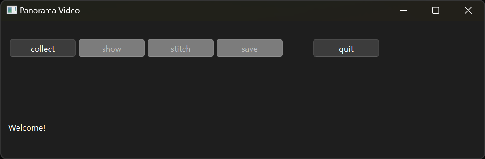
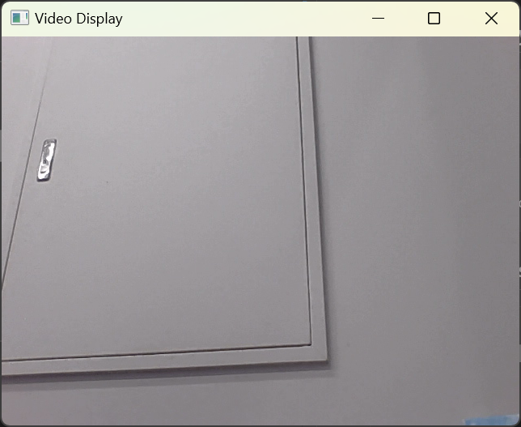
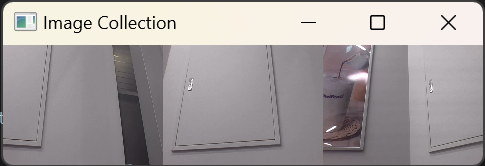
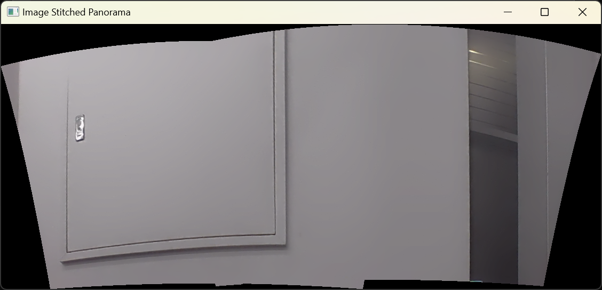

# Panorama Vision Agent

## Dependencies

```toml
python = ">=3.11,<3.14"
pyqt6 = "^6.7.1"
opencv-python = "^4.10.0.84"
pyinstaller = "^6.11.0"
```

## 📌Install Library

```PowerShell
# pip
pip install PyQt6 opencv-python pyinstaller
```
```PowerShell
# poetry
poetry add PyQt6 opencv-python pyinstaller
```

## How To Use This Application?

* PowerShell
```PowerShell
python <Your_App_Path>
```

* If you want to make exe file...
```PowerShell
pyinstaller <Your_App_Path>
```

### 1. Initial Screen


This is intial screen. `show`, `stitch`, `save` buttons are deactivated



### 2. Push `collect`

Check your Webcam



**On your keyboard, push...**
* C Button: Capture Video
* Q Button: Quit Video

If you capture Video (by pushing 'C') and quit your Webcam (by pushing 'Q'), `show`, `stitch`, `save` buttons will be activated.

### 3. Push `show`

Captured images will be displayed




### 4. Push `stitch`

Panorama image will be displayed




### 5. Push `save`

Save your image.